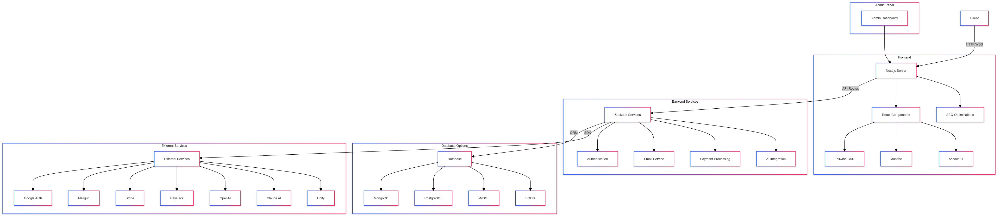

# Endeavor - Full-Stack Boilerplate for Building MVPs

Endeavor is an ambitious attempt at creating a powerful, flexible, and feature-rich boilerplate for building full-stack MVP (Minimum Viable Product) applications. Named after the determined and ambitious hero from My Hero Academia, Endeavor aims to provide developers with an ever-burning robust foundation to rapidly build and scale their ideas.

## 🔥 The Spark Behind Endeavor

As a developer who has participated in numerous hackathons, dabbled in micro SaaS ventures, and explored various startup ideas, I've consistently found myself rebuilding the same foundational elements for each new project. The cycle of starting from scratch, integrating authentication, setting up databases, and implementing basic features became a time-consuming routine that often delayed the actual innovation process.

This recurring experience sparked the idea for Endeavor. I envisioned a boilerplate that could significantly reduce the initial setup time, allowing developers (including myself) to focus on what truly matters - bringing unique ideas to life.

## 🚀 The Vision

While Endeavor is in its early stages, the goal is ambitious and clear: to create a comprehensive, flexible boilerplate that enables developers to build profitable products rapidly - potentially in just a day or over a weekend! 

The ultimate vision for Endeavor includes:

1. **Rapid MVP Development**: Equipping developers with tools to transform ideas into functional MVPs at unprecedented speed.
2. **Flexibility and Extensibility**: Providing a foundation that's easily customizable and extendable, allowing developers to build on top of Endeavor to create something truly unique.
3. **Community-Driven Evolution**: As the project grows, I hope to foster a community of developers who can contribute, extend, and build amazing products using Endeavor.

## 🚀 Features



### Core (Free & Open-Source)
- ⚡ Next.js for full-stack development
- 🎨 UI Libraries: Tailwind CSS, Mantine, and shadcn/ui
- 🔐 Authentication: Google Auth, Email verification, Magic links
- 📧 Email integration with Mailgun
- 💳 Payment processing with Stripe and Paystack
- 🔍 SEO optimizations
- 🗄️ Database support: MongoDB, PostgreSQL, MySQL, SQLite

### Commercial Add-ons
- 🛠️ Admin panel
- 🤖 OpenAI integration
- 🧠 Claude AI integration

### AI Optimized Add-ons
- 🔗 Unify integration for unified AI access
- 📚 LlamaIndex integration for efficient data indexing and retrieval

## 🎯 Focus

The idea behind Endeavor is a focus on providing a solid foundation for startups and developers to quickly build MVPs without compromising on quality or scalability. The key principles are:

1. **Rapid Development**: Get your MVP up and running in record time.
2. **Flexibility**: Choose the components that fit your project's needs.
3. **Scalability**: Start small and scale up as your project grows.
4. **Best Practices**: Incorporate industry standards and best practices out of the box.

## 🗺️ Roadmap

### Phase 1: Core Implementation
- [ ] Set up Next.js with JavaScript
- [ ] Integrate UI libraries
- [ ] Implement authentication system
- [ ] Set up database ORM with multi-database support
- [ ] Add email and payment integrations
- [ ] Implement SEO optimizations

### Phase 2: Commercial Features
- [ ] Develop admin panel
- [ ] Integrate OpenAI
- [ ] Integrate Claude AI

### Phase 3: AI Optimizations
- [ ] Integrate Unify
- [ ] Implement LlamaIndex

### Phase 4: Advanced Features
- [ ] Implement internationalization (i18n) support
- [ ] Add advanced security features
- [ ] Optimize performance (SSR, code splitting, etc.)
- [ ] Create comprehensive documentation and tutorials

## 🌱 Current Status

Endeavor is currently in its infancy. The features and components listed are part of the project's roadmap and vision. As a solo developer starting this journey, I'm committed to bringing this vision to life incrementally.

I welcome early adopters, contributors, and anyone interested in shaping the future of rapid MVP development to join this journey. Together, we can create a tool that empowers developers to turn their ideas into reality faster than ever before.

## 🤝 Contributing

As Endeavor is just starting, your contributions, ideas, and feedback are incredibly valuable. Whether it's suggesting features, improving documentation, or contributing code, every input helps shape this project. Please see our [Contributing Guide](CONTRIBUTING.md) for more details on how you can be part of this exciting journey.

## 🛠️ Installation

```bash
npx create-endeavor-app my-awesome-project
cd my-awesome-project
npm run dev
```

## 📚 Documentation

For full documentation, visit [docs.endeavorboilerplate.com](https://docs.endeavorboilerplate.com)

## 📄 License

Endeavor is open-source software licensed under the MIT license.

## 🙏 Acknowledgements

Endeavor is inspired by the relentless spirit of the hero Endeavor from My Hero Academia. I aim to embody that same determination in providing the best tools for developers to bring their ideas to life.

Key Components that make Endeavor burn are:
- **Next.js**: The foundation for building fast and scalable web applications.
- **Tailwind CSS**: A utility-first CSS framework for rapid UI development.
- **Mantine**: A React component library for building beautiful and responsive interfaces.
- **shadcn/ui**: A collection of accessible and customizable components for building modern web applications.
- **MongoDB**: A flexible and scalable NoSQL database for storing and managing data.
- **PostgreSQL**: A powerful and feature-rich relational database
- **MySQL**: A popular open-source relational database management system.
- **SQLite**: A lightweight and embeddable SQL database engine.
- **NextAuth**: A secure and easy-to-use authentication system.
- **Mailgun**: A reliable email delivery service for sending transactional emails.
- **Stripe**: A powerful and flexible payment processing platform.
- **Paystack**: A popular payment gateway for payment processing in Africa.
- **Unify**: A unified AI platform for accessing multiple AI services.
- **LlamaIndex**: A powerful indexing and retrieval system for AI applications.
- **OpenAI**: An AI platform for developing and deploying AI models.
- **Claude AI**: A powerful AI platform for natural language processing and understanding.
- **i18n**: Internationalization support for building multilingual applications.
---

Built with ❤️ and determination by Kwesi Navilot